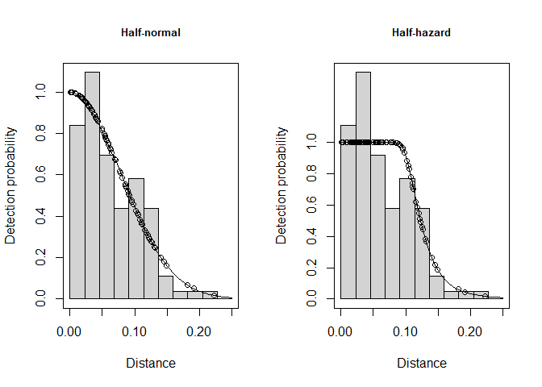

Distance sampling-lab
================
Nick Gulotta
11/3/2021

``` r
require(Distance)
require(readr)
require(gridExtra)

#data
data<-read.csv("/Users/nickg/OneDrive/Desktop/R projects/Population-dynamics-FANR/data/gazelle_data.csv")
```

### **Data manipulation**

``` r
#Data manipulation
data2 <- data[,c("Transect", "GroupSize")]
colnames(data2) <- c("Sample.Label", "size") ## Rename
data2$distance <- data$Distance / 1000 ## Convert to km
data2$Region.Label <- 1 ## Just one region
data2$Effort <- data$TransectLength / 1000 ## Convert to km
data2$Area <- data$RegionArea ## Square km
```

### **Half-normal model**

``` r
model.hn <- ds(data=data2, key="hn",
               transect="line", truncation=250/1000,
               adjustment=NULL, quiet=TRUE)
summary(model.hn)
```

    ## 
    ## Summary for distance analysis 
    ## Number of observations :  118 
    ## Distance range         :  0  -  0.25 
    ## 
    ## Model : Half-normal key function 
    ## AIC   : -430.3899 
    ## 
    ## Detection function parameters
    ## Scale coefficient(s):  
    ##              estimate         se
    ## (Intercept) -2.548889 0.07142174
    ## 
    ##                        Estimate         SE         CV
    ## Average p             0.3913367  0.0275207 0.07032488
    ## N in covered region 301.5306612 30.3090846 0.10051742
    ## 
    ## Summary for clusters
    ## 
    ## Summary statistics:
    ##   Region Area CoveredArea Effort   n  k  ER    se.ER      cv.ER
    ## 1      1    5         0.5      1 118 10 118 8.919392 0.07558807
    ## 
    ## Abundance:
    ##   Label Estimate       se        cv      lcl      ucl       df
    ## 1 Total 3015.307 311.3097 0.1032431 2443.168 3721.429 29.61684
    ## 
    ## Density:
    ##   Label Estimate       se        cv      lcl      ucl       df
    ## 1 Total 603.0613 62.26194 0.1032431 488.6335 744.2857 29.61684
    ## 
    ## Summary for individuals
    ## 
    ## Summary statistics:
    ##   Region Area CoveredArea Effort      n     ER    se.ER      cv.ER mean.size
    ## 1      1    5         0.5      1 354825 354825 27204.24 0.07666945  3006.992
    ##    se.mean
    ## 1 5.061028
    ## 
    ## Abundance:
    ##   Label Estimate       se        cv     lcl      ucl       df
    ## 1 Total  9067001 943307.8 0.1040375 7333216 11210704 28.93915
    ## 
    ## Density:
    ##   Label Estimate       se        cv     lcl     ucl       df
    ## 1 Total  1813400 188661.6 0.1040375 1466643 2242141 28.93915
    ## 
    ## Expected cluster size
    ##   Region Expected.S se.Expected.S cv.Expected.S
    ## 1  Total   3006.992      5.079631   0.001689274
    ## 2  Total   3006.992      5.079631   0.001689274

### **Half-hazard model**

``` r
model.hr <- ds(data=data2, key="hr",
               transect="line", truncation=250/1000,
               adjustment=NULL, quiet=TRUE)
summary(model.hr)
```

    ## 
    ## Summary for distance analysis 
    ## Number of observations :  118 
    ## Distance range         :  0  -  0.25 
    ## 
    ## Model : Hazard-rate key function 
    ## AIC   : -426.2041 
    ## 
    ## Detection function parameters
    ## Scale coefficient(s):  
    ##              estimate         se
    ## (Intercept) -2.158617 0.06742034
    ## 
    ## Shape coefficient(s):  
    ##             estimate        se
    ## (Intercept) 1.816185 0.2166982
    ## 
    ##                        Estimate          SE         CV
    ## Average p             0.5178954  0.02737977 0.05286737
    ## N in covered region 227.8452434 18.89961069 0.08294933
    ## 
    ## Summary for clusters
    ## 
    ## Summary statistics:
    ##   Region Area CoveredArea Effort   n  k  ER    se.ER      cv.ER
    ## 1      1    5         0.5      1 118 10 118 8.919392 0.07558807
    ## 
    ## Abundance:
    ##   Label Estimate       se         cv      lcl      ucl       df
    ## 1 Total 2278.452 210.1681 0.09224161 1879.934 2761.451 19.59512
    ## 
    ## Density:
    ##   Label Estimate       se         cv      lcl      ucl       df
    ## 1 Total 455.6905 42.03363 0.09224161 375.9868 552.2902 19.59512
    ## 
    ## Summary for individuals
    ## 
    ## Summary statistics:
    ##   Region Area CoveredArea Effort      n     ER    se.ER      cv.ER mean.size
    ## 1      1    5         0.5      1 354825 354825 27204.24 0.07666945  3006.992
    ##    se.mean
    ## 1 5.061028
    ## 
    ## Abundance:
    ##   Label Estimate       se         cv     lcl     ucl       df
    ## 1 Total  6851287 638059.2 0.09312982 5641268 8320849 19.25557
    ## 
    ## Density:
    ##   Label Estimate       se         cv     lcl     ucl       df
    ## 1 Total  1370257 127611.8 0.09312982 1128254 1664170 19.25557
    ## 
    ## Expected cluster size
    ##   Region Expected.S se.Expected.S cv.Expected.S
    ## 1  Total   3006.992      5.079631   0.001689274
    ## 2  Total   3006.992      5.079631   0.001689274

### **Plot**

<!-- -->

### **Table**

<table class="table table-striped table-hover table-condensed table-bordered" style="margin-left: auto; margin-right: auto;">
<caption>
<center>
<strong>Table 1. Results for distance sampling of gazelle for
half-normal and half-hazard models.</strong>
</center>
</caption>
<thead>
<tr>
<th style="text-align:center;">
Model
</th>
<th style="text-align:center;">
pbar
</th>
<th style="text-align:center;">
Abundance
</th>
<th style="text-align:center;">
SE(N)
</th>
<th style="text-align:center;">
Density
</th>
<th style="text-align:center;">
SE(D)
</th>
<th style="text-align:center;">
AIC
</th>
</tr>
</thead>
<tbody>
<tr>
<td style="text-align:center;">
Half-normal
</td>
<td style="text-align:center;">
0.39
</td>
<td style="text-align:center;">
9067001
</td>
<td style="text-align:center;">
943307.8
</td>
<td style="text-align:center;">
1813400
</td>
<td style="text-align:center;">
188661.6
</td>
<td style="text-align:center;">
-430.39
</td>
</tr>
<tr>
<td style="text-align:center;">
Half-hazard
</td>
<td style="text-align:center;">
0.52
</td>
<td style="text-align:center;">
6851287
</td>
<td style="text-align:center;">
638059.2
</td>
<td style="text-align:center;">
1370257
</td>
<td style="text-align:center;">
127611.8
</td>
<td style="text-align:center;">
-426.20
</td>
</tr>
</tbody>
</table>
