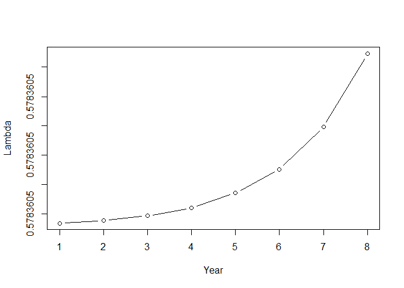

Lab 13
================
Nick Gulotta
12/7/2021

``` r
require(marked)
require(readr)
require(gridExtra)
require(dplyr)

#data
cjs.data <- read.table("/Users/nickg/OneDrive/Desktop/R projects/Population-dynamics-FANR/data/cawa-cjs.inp", sep=" ",
                               colClasses=c("character","character"),
                               col.names=c("ch", "count"))

js.data <- read.table("/Users/nickg/OneDrive/Desktop/R projects/Population-dynamics-FANR/data/CH-SO-Dean-AllYears.inp", sep=" ",
                               colClasses=c("character","character"),
                               col.names=c("ch", "count"))
```

### **Exercise I**

#### ***Φ*(.)*p*(.) – No variation in apparent survival**

``` r
phi0.p0 <- crm(data=cjs.data, model="CJS", hessian=TRUE,
model.parameters=list(
Phi=list(formula=~1), ## No variation
p=list(formula=~1))) ## No variation

phi0.p0
```

    ## 
    ## crm Model Summary
    ## 
    ## Npar :  2
    ## -2lnL:  164.6401
    ## AIC  :  168.6401
    ## 
    ## Beta
    ##                   Estimate        se       lcl        ucl
    ## Phi.(Intercept) -1.0097503 0.4370454 -1.866359 -0.1531413
    ## p.(Intercept)   -0.4517833 0.6526286 -1.730935  0.8273687

``` r
predict(phi0.p0)
```

    ## $Phi
    ##   occ  estimate         se       lcl       ucl
    ## 1   4 0.2670287 0.08554045 0.1339635 0.4617893
    ## 
    ## $p
    ##   occ  estimate       se      lcl       ucl
    ## 1   5 0.3889369 0.155107 0.150468 0.6957983

#### ***Φ*(*t*)*p*(.) – Temporal variation in apparent survival**

``` r
phiTime.p0 <- crm(data=cjs.data, model="cjs", hessian=TRUE,
model.parameters=list(
Phi=list(formula=~time), ## Temporal variation
p=list(formula=~1))) ## No variation
```

    ##  Number of evaluations:  100  -2lnl:  164.407839 Number of evaluations:  200  -2lnl: 164.4079065 Number of evaluations:  100  -2lnl: 164.4290037

``` r
phiTime.p0
```

    ## 
    ## crm Model Summary
    ## 
    ## Npar :  5
    ## -2lnL:  164.4078
    ## AIC  :  174.4078
    ## 
    ## Beta
    ##                    Estimate        se       lcl       ucl
    ## Phi.(Intercept) -1.09642447 0.7582738 -2.582641 0.3897923
    ## Phi.time2       -0.07076579 0.8377325 -1.712722 1.5711899
    ## Phi.time3        0.21627966 0.7976686 -1.347151 1.7797100
    ## Phi.time4        0.17197565 0.7911950 -1.378767 1.7227179
    ## p.(Intercept)   -0.45509195 0.6654899 -1.759452 0.8492683

``` r
predict(phiTime.p0)
```

    ## $Phi
    ##   time occ  estimate        se        lcl       ucl
    ## 1    4   4 0.2840523 0.1344567 0.09794132 0.5918005
    ## 2    3   3 0.2931478 0.1227856 0.11490777 0.5698580
    ## 3    2   2 0.2373632 0.1064269 0.08951926 0.4962847
    ## 4    1   1 0.2504104 0.1423318 0.07026401 0.5962327
    ## 
    ## $p
    ##   occ  estimate       se      lcl       ucl
    ## 1   5 0.3881508 0.158047 0.146859 0.7004136

#### ***Φ*(.)*p*(*t*) – Temporal variation in capture probability**

``` r
pTime.p0<-crm(data=cjs.data, model="cjs", hessian=TRUE,
model.parameters=list(
Phi=list(formula=~1), ## no variation
p=list(formula=~time))) ## variation
```

    ##  Number of evaluations:  100  -2lnl: 164.2918996 Number of evaluations:  200  -2lnl: 164.2926682 Number of evaluations:  100  -2lnl: 164.3644499

``` r
pTime.p0
```

    ## 
    ## crm Model Summary
    ## 
    ## Npar :  5
    ## -2lnL:  164.2916
    ## AIC  :  174.2916
    ## 
    ## Beta
    ##                   Estimate        se       lcl        ucl
    ## Phi.(Intercept) -1.0727457 0.4417633 -1.938602 -0.2068896
    ## p.(Intercept)   -0.7340805 0.8873394 -2.473266  1.0051047
    ## p.time3          0.2493750 0.9992171 -1.709090  2.2078404
    ## p.time4          0.5362343 1.0492990 -1.520392  2.5928604
    ## p.time5          0.5132146 1.0604845 -1.565335  2.5917642

``` r
predict(pTime.p0)
```

    ## $Phi
    ##   occ  estimate         se       lcl       ucl
    ## 1   4 0.2548813 0.08389828 0.1258015 0.4484613
    ## 
    ## $p
    ##   time occ  estimate        se        lcl       ucl
    ## 1    5   5 0.4450069 0.2350247 0.11046285 0.8381180
    ## 2    4   4 0.4506992 0.2245909 0.12175380 0.8292377
    ## 3    3   3 0.3811416 0.1904568 0.11231406 0.7498679
    ## 4    2   2 0.3242999 0.1944422 0.07775371 0.7320611

#### ***Φ*(*t*)*p*(*t*) – Temporal variation in apparent survival and capture probability**

``` r
pPhiTime.p0<-crm(data=cjs.data, model="cjs", hessian=TRUE,
model.parameters=list(
Phi=list(formula=~time), ## variation
p=list(formula=~time))) ## variation
```

    ##  Number of evaluations:  100  -2lnl: 164.3386705 Number of evaluations:  200  -2lnl: 164.0160127 Number of evaluations:  300  -2lnl: 164.0267951 Number of evaluations:  400  -2lnl: 164.0190582 Number of evaluations:  500  -2lnl: 164.0218229 Number of evaluations:  100  -2lnl: 164.0485203 Number of evaluations:  200  -2lnl: 164.0197031

``` r
pPhiTime.p0
```

    ## 
    ## crm Model Summary
    ## 
    ## Npar :  8
    ## -2lnL:  164.016
    ## AIC  :  180.016
    ## 
    ## Beta
    ##                   Estimate        se         lcl        ucl
    ## Phi.(Intercept) -0.5878274  1.258314   -3.054123   1.878468
    ## Phi.time2       -0.7997844  1.616899   -3.968907   2.369338
    ## Phi.time3       -0.3963709  1.515245   -3.366252   2.573510
    ## Phi.time4        0.1714588 93.789755 -183.656461 183.999378
    ## p.(Intercept)   -1.1526344  1.217571   -3.539073   1.233805
    ## p.time3          0.9584416  1.665046   -2.305048   4.221931
    ## p.time4          0.9172804  1.658919   -2.334201   4.168762
    ## p.time5          0.2284426 78.951377 -154.516256 154.973142

``` r
pPhiTime.p<-predict(pPhiTime.p0)
```

#### **Which model is the best?**

**The first model that had no variation was the best model since it had
the lowest AIC score.**

<table class="table table-striped table-hover table-condensed table-bordered" style="margin-left: auto; margin-right: auto;">
<caption>
<center>
<strong>Table 1. Results for distance sampling of gazelle for
half-normal and half-hazard models.</strong>
</center>
</caption>
<thead>
<tr>
<th style="text-align:center;">
Model
</th>
<th style="text-align:center;">
Term
</th>
<th style="text-align:center;">
occ
</th>
<th style="text-align:center;">
Estimate
</th>
<th style="text-align:center;">
SE
</th>
<th style="text-align:center;">
lcl
</th>
<th style="text-align:center;">
ucl
</th>
<th style="text-align:center;">
AIC
</th>
</tr>
</thead>
<tbody>
<tr>
<td style="text-align:center;">
No variation in apprent surival or capture probability
</td>
<td style="text-align:center;">
Phi
</td>
<td style="text-align:center;">
4
</td>
<td style="text-align:center;">
0.27
</td>
<td style="text-align:center;">
0.09
</td>
<td style="text-align:center;">
0.13
</td>
<td style="text-align:center;">
0.46
</td>
<td style="text-align:center;">
168.64
</td>
</tr>
<tr>
<td style="text-align:center;">
</td>
<td style="text-align:center;">
p
</td>
<td style="text-align:center;">
5
</td>
<td style="text-align:center;">
0.39
</td>
<td style="text-align:center;">
0.16
</td>
<td style="text-align:center;">
0.15
</td>
<td style="text-align:center;">
0.70
</td>
<td style="text-align:center;">
</td>
</tr>
</tbody>
</table>

### **Exercise II**

#### **Jolly-Serber w/constant capture probability (p), constant entrance probabilities (pent, *b*<sub>*t*</sub>), and temporal variation in apparent survival**

``` r
js.phi0.pent0.p0 <- crm(data=js.data, model="JS", hessian=TRUE,
                        model.parameters=list(
                          Phi=list(formula=~time), ## No variation
                          pent=list(formula=~1), ## No variation
                          p=list(formula=~1))) ## No variation
```

    ## Starting optimization 11  parameters
    ##  Number of evaluations:  100  -2lnl: -113.2691248 Number of evaluations:  200  -2lnl: -134.4672245 Number of evaluations:  300  -2lnl: -139.6788414 Number of evaluations:  400  -2lnl: -141.0508039 Number of evaluations:  500  -2lnl: -141.1281882 Number of evaluations:  600  -2lnl: -141.1402195 Number of evaluations:  700  -2lnl: -141.1758874 Number of evaluations:  800  -2lnl: -141.202416 Number of evaluations:  900  -2lnl: -141.2056587 Number of evaluations:  1000  -2lnl: -141.2069643 Number of evaluations:  1100  -2lnl: -141.1842722 Number of evaluations:  1200  -2lnl: -141.2062709 Number of evaluations:  1300  -2lnl: -141.1811164 Number of evaluations:  1400  -2lnl: -141.2061162 Number of evaluations:  1500  -2lnl: -140.9573627 Number of evaluations:  1600  -2lnl: -140.7468623 Number of evaluations:  1700  -2lnl: -141.2077277Computing hessian
    ##  Number of evaluations:  100  -2lnl: -141.1840858 Number of evaluations:  200  -2lnl: -141.1891034 Number of evaluations:  300  -2lnl: -141.1822162 Number of evaluations:  400  -2lnl: -141.2077139 Number of evaluations:  500  -2lnl: -135.6026371

``` r
js0est <- predict(js.phi0.pent0.p0)
js0est
```

    ## $Phi
    ##   time occ  estimate          se           lcl       ucl
    ## 1    1   1 0.5783605 0.089419133  4.006754e-01 0.7378348
    ## 2    2   2 1.0000000 0.000000000  0.000000e+00 1.0000000
    ## 3    3   3 0.9999863 0.002901706 1.554535e-176 1.0000000
    ## 4    4   4 0.1104871 0.050412366  4.347366e-02 0.2534309
    ## 5    5   5 0.9999894 0.002036188 4.670797e-159 1.0000000
    ## 6    6   6 0.1708337 0.171580991  1.881898e-02 0.6887818
    ## 7    7   7 0.9999606 0.009489089 2.154812e-201 1.0000000
    ## 8    8   8 0.9999461 0.008419764 2.464963e-129 1.0000000
    ## 
    ## $p
    ##   occ  estimate         se       lcl       ucl
    ## 1   1 0.2604266 0.03625413 0.1958109 0.3374184
    ## 
    ## $pent
    ##   time occ     estimate           se lcl ucl
    ## 1    2   2 6.344774e-16 6.344746e-11   0   1
    ## 2    3   3 6.344774e-16 6.344746e-11   0   1
    ## 3    4   4 6.344774e-16 6.344746e-11   0   1
    ## 4    5   5 6.344774e-16 6.344746e-11   0   1
    ## 5    6   6 6.344774e-16 6.344746e-11   0   1
    ## 6    7   7 6.344774e-16 6.344746e-11   0   1
    ## 7    8   8 6.344774e-16 6.344746e-11   0   1
    ## 8    9   9 6.344774e-16 6.344746e-11   0   1
    ## 
    ## $N
    ##   estimate       se      lcl      ucl
    ## 1 72.82629 21.77808 40.52649 130.8692

``` r
n <- nrow(js.data) # number of individuals captured
Nsuper <- n+js0est$N$estimate # Super-population size
Nsuper
```

    ## [1] 153.8263

``` r
b <- js0est$pent$estimate # Entrance probabilities after first time period
b0 <- 1-sum(b) # Compute first entrance probability
round(b, digits=16)
```

    ## [1] 6e-16 6e-16 6e-16 6e-16 6e-16 6e-16 6e-16 6e-16

``` r
R <- Nsuper*b # Recruits
R
```

    ## [1] 9.759931e-14 9.759931e-14 9.759931e-14 9.759931e-14 9.759931e-14
    ## [6] 9.759931e-14 9.759931e-14 9.759931e-14

``` r
Phi <- js0est$Phi$estimate ## Apparent survival probability
Phi
```

    ## [1] 0.5783605 1.0000000 0.9999863 0.1104871 0.9999894 0.1708337 0.9999606
    ## [8] 0.9999461

#### **Interpretation of estimates**

**The capture probability was p= 0.26, and the estimated number of
individuals not detected was n= 72.82. **

#### **Compute: super population size, number of recruits in each time interval, abundance at each time point**

``` r
n <- nrow(js.data) # number of individuals captured
Nsuper <- n+js0est$N$estimate # Super-population size
Nsuper
```

    ## [1] 153.8263

``` r
b <- js0est$pent$estimate # Entrance probabilities after first time period
b0 <- 1-sum(b) # Compute first entrance probability
round(b, digits=16)
```

    ## [1] 6e-16 6e-16 6e-16 6e-16 6e-16 6e-16 6e-16 6e-16

``` r
R <- Nsuper*b # Recruits
R
```

    ## [1] 9.759931e-14 9.759931e-14 9.759931e-14 9.759931e-14 9.759931e-14
    ## [6] 9.759931e-14 9.759931e-14 9.759931e-14

``` r
Phi <- js0est$Phi$estimate ## Apparent survival probability
Phi
```

    ## [1] 0.5783605 1.0000000 0.9999863 0.1104871 0.9999894 0.1708337 0.9999606
    ## [8] 0.9999461

``` r
nYears <- length(R)+1
N <- rep(NA, nYears)
N[1] <- Nsuper*b0 ## Initial abundance
N[2] <- N[1]*Phi + R[1] ## Abundance in year 2
```

    ## Warning in N[2] <- N[1] * Phi + R[1]: number of items to replace is not a
    ## multiple of replacement length

``` r
N[3] <- N[2]*Phi + R[2] ## Abundance in year 3
```

    ## Warning in N[3] <- N[2] * Phi + R[2]: number of items to replace is not a
    ## multiple of replacement length

``` r
N[4] <- N[3]*Phi + R[3] ## Abundance in year 4
```

    ## Warning in N[4] <- N[3] * Phi + R[3]: number of items to replace is not a
    ## multiple of replacement length

``` r
N[5] <- N[4]*Phi + R[4] ## Abundance in year 5
```

    ## Warning in N[5] <- N[4] * Phi + R[4]: number of items to replace is not a
    ## multiple of replacement length

``` r
N[6] <- N[5]*Phi + R[5] ## Abundance in year 6
```

    ## Warning in N[6] <- N[5] * Phi + R[5]: number of items to replace is not a
    ## multiple of replacement length

``` r
N[7] <- N[6]*Phi + R[6] ## Abundance in year 7
```

    ## Warning in N[7] <- N[6] * Phi + R[6]: number of items to replace is not a
    ## multiple of replacement length

``` r
N[8] <- N[7]*Phi + R[7] ## Abundance in year 8
```

    ## Warning in N[8] <- N[7] * Phi + R[7]: number of items to replace is not a
    ## multiple of replacement length

``` r
N[9] <- N[8]*Phi + R[8] ## Abundance in year 9
```

    ## Warning in N[9] <- N[8] * Phi + R[8]: number of items to replace is not a
    ## multiple of replacement length

``` r
round(N, digits=0)
```

    ## [1] 154  89  51  30  17  10   6   3   2

#### **Plot**

``` r
lambda <- N[2:9]/N[1:8]
lam<-round(lambda, digits=16)

Years<-1:8

plot(Years, lam, type="b", xlab="Year", ylab="Lambda")
```

<!-- -->
