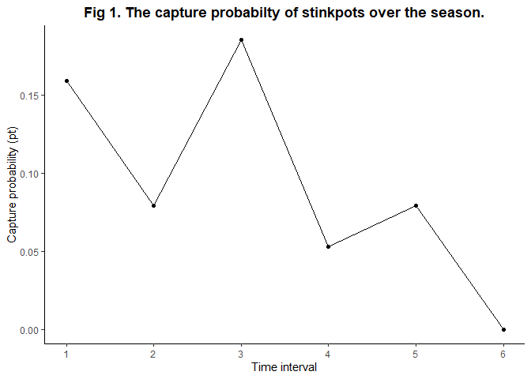

Mark-recapture lab
================
Nick Gulotta
11/10/2021

### **Question 1**

**The Lincoln-Peterson estimate of abundance is N=200.**

``` r
n1<-100
n2<-50
m2<-25

N<-n1*n2/m2
N
```

    ## [1] 200

### **Models**

``` r
require(mra)
```

    ## Loading required package: mra

    ## mra (version 2.16.11)

``` r
#M0 model
M0 <- F.huggins.estim(capture=~1, recapture=NULL, histories=ch.mat)
M0
```

    ## Call:
    ## F.huggins.estim(capture = ~1, recapture = NULL, histories = ch.mat)
    ## 
    ##  Capture and Recapture model:
    ##  Variable     Est       SE     
    ##  (Intercept)  -2.37255  0.49911 
    ## 
    ## Population Size Estimate (se): 41.0364 (16.6626)
    ## 95% confidence interval for population size: 24.04 to 99.05
    ## Individuals observed: 17
    ## Effective sample size: 102
    ## 
    ## Message =  SUCCESS: Convergence criterion met
    ## Number of estimable coefficients (estimated) =  1
    ## Log likelihood =  -43.9354578026216
    ## Deviance =  87.8709156052432
    ## AIC =  89.8709156052432
    ## AICc =  89.9109156052432

``` r
round(M0$p.hat, digits=3)
```

    ##        [,1]  [,2]  [,3]  [,4]  [,5]  [,6]
    ##  [1,] 0.085 0.085 0.085 0.085 0.085 0.085
    ##  [2,] 0.085 0.085 0.085 0.085 0.085 0.085
    ##  [3,] 0.085 0.085 0.085 0.085 0.085 0.085
    ##  [4,] 0.085 0.085 0.085 0.085 0.085 0.085
    ##  [5,] 0.085 0.085 0.085 0.085 0.085 0.085
    ##  [6,] 0.085 0.085 0.085 0.085 0.085 0.085
    ##  [7,] 0.085 0.085 0.085 0.085 0.085 0.085
    ##  [8,] 0.085 0.085 0.085 0.085 0.085 0.085
    ##  [9,] 0.085 0.085 0.085 0.085 0.085 0.085
    ## [10,] 0.085 0.085 0.085 0.085 0.085 0.085
    ## [11,] 0.085 0.085 0.085 0.085 0.085 0.085
    ## [12,] 0.085 0.085 0.085 0.085 0.085 0.085
    ## [13,] 0.085 0.085 0.085 0.085 0.085 0.085
    ## [14,] 0.085 0.085 0.085 0.085 0.085 0.085
    ## [15,] 0.085 0.085 0.085 0.085 0.085 0.085
    ## [16,] 0.085 0.085 0.085 0.085 0.085 0.085
    ## [17,] 0.085 0.085 0.085 0.085 0.085 0.085

``` r
#Mb model
Mb <- F.huggins.estim(capture=~1, recapture=~1, histories=ch.mat)
Mb
```

    ## Call:
    ## F.huggins.estim(capture = ~1, recapture = ~1, histories = ch.mat)
    ## 
    ##  Capture Model   Est       SE           Recapture Model   Est       SE     
    ##  (Intercept)     -0.67847  0.48712      C:(Intercept)     -0.67847  0.48712(fixed) 
    ##                                         B:(Intercept)     -1.97829  0.71051 
    ## 
    ## Population Size Estimate (se): 18.5841 (2.1527)
    ## 95% confidence interval for population size: 17.21 to 28.76
    ## Individuals observed: 17
    ## Effective sample size: 102
    ## 
    ## Message =  SUCCESS: Convergence criterion met
    ## Number of estimable coefficients (estimated) =  2
    ## Log likelihood =  -41.6092532319818
    ## Deviance =  83.2185064639637
    ## AIC =  87.2185064639637
    ## AICc =  87.3397185851758

``` r
round(Mb$p.hat, digits=3)
```

    ##        [,1]  [,2]  [,3]  [,4]  [,5]  [,6]
    ##  [1,] 0.337 0.337 0.337 0.337 0.337 0.337
    ##  [2,] 0.337 0.337 0.337 0.337 0.337 0.337
    ##  [3,] 0.337 0.337 0.337 0.337 0.337 0.337
    ##  [4,] 0.337 0.337 0.337 0.337 0.337 0.337
    ##  [5,] 0.337 0.337 0.337 0.337 0.337 0.337
    ##  [6,] 0.337 0.337 0.337 0.337 0.337 0.337
    ##  [7,] 0.337 0.337 0.337 0.337 0.337 0.337
    ##  [8,] 0.337 0.337 0.337 0.337 0.337 0.337
    ##  [9,] 0.337 0.337 0.337 0.337 0.337 0.337
    ## [10,] 0.337 0.337 0.337 0.337 0.337 0.337
    ## [11,] 0.337 0.337 0.337 0.337 0.337 0.337
    ## [12,] 0.337 0.337 0.337 0.337 0.337 0.337
    ## [13,] 0.337 0.337 0.337 0.337 0.337 0.337
    ## [14,] 0.337 0.337 0.337 0.337 0.337 0.337
    ## [15,] 0.337 0.337 0.337 0.337 0.337 0.337
    ## [16,] 0.337 0.337 0.337 0.337 0.337 0.337
    ## [17,] 0.337 0.337 0.337 0.337 0.337 0.337

``` r
round(Mb$c.hat, digits=3)                      
```

    ##       [,1]  [,2]  [,3]  [,4]  [,5]  [,6]
    ##  [1,]   NA 0.066 0.066 0.066 0.066 0.066
    ##  [2,]   NA 0.066 0.066 0.066 0.066 0.066
    ##  [3,]   NA 0.066 0.066 0.066 0.066 0.066
    ##  [4,]   NA 0.066 0.066 0.066 0.066 0.066
    ##  [5,]   NA 0.066 0.066 0.066 0.066 0.066
    ##  [6,]   NA 0.066 0.066 0.066 0.066 0.066
    ##  [7,]   NA 0.066 0.066 0.066 0.066 0.066
    ##  [8,]   NA 0.066 0.066 0.066 0.066 0.066
    ##  [9,]   NA 0.066 0.066 0.066 0.066 0.066
    ## [10,]   NA 0.066 0.066 0.066 0.066 0.066
    ## [11,]   NA 0.066 0.066 0.066 0.066 0.066
    ## [12,]   NA 0.066 0.066 0.066 0.066 0.066
    ## [13,]   NA 0.066 0.066 0.066 0.066 0.066
    ## [14,]   NA 0.066 0.066 0.066 0.066 0.066
    ## [15,]   NA 0.066 0.066 0.066 0.066 0.066
    ## [16,]   NA 0.066 0.066 0.066 0.066 0.066
    ## [17,]   NA 0.066 0.066 0.066 0.066 0.066

``` r
#Mt model                      
time <- tvar(factor(1:6), nan=nrow(ch.mat)) ## 6 time periods. 14 animals.
Mt <- F.huggins.estim(capture=~time, recapture=NULL, histories=ch.mat)
Mt
```

    ## Call:
    ## F.huggins.estim(capture = ~time, recapture = NULL, histories = ch.mat)
    ## 
    ##  Capture and Recapture model:
    ##  Variable     Est        SE          
    ##  (Intercept)  -1.66753   0.64342      
    ##  time:2       -0.78331   0.74956      
    ##  time:3       0.18611    0.6113       
    ##  time:4       -1.21711   0.85368      
    ##  time:5       -0.78331   0.74956      
    ##  time:6       -31.02057  268608.00057 
    ## 
    ## Population Size Estimate (se): 37.7944 (14.7706)
    ## 95% confidence interval for population size: 22.94 to 89.78
    ## Individuals observed: 17
    ## Effective sample size: 102
    ## 
    ## Message =  SUCCESS: Convergence criterion met
    ## Number of estimable coefficients (estimated) =  5
    ## Log likelihood =  -37.42450409473
    ## Deviance =  74.8490081894601
    ## AIC =  84.8490081894601
    ## AICc =  85.4740081894601

``` r
round(Mt$p.hat, digits=3)
```

    ##        [,1]  [,2]  [,3]  [,4]  [,5] [,6]
    ##  [1,] 0.159 0.079 0.185 0.053 0.079    0
    ##  [2,] 0.159 0.079 0.185 0.053 0.079    0
    ##  [3,] 0.159 0.079 0.185 0.053 0.079    0
    ##  [4,] 0.159 0.079 0.185 0.053 0.079    0
    ##  [5,] 0.159 0.079 0.185 0.053 0.079    0
    ##  [6,] 0.159 0.079 0.185 0.053 0.079    0
    ##  [7,] 0.159 0.079 0.185 0.053 0.079    0
    ##  [8,] 0.159 0.079 0.185 0.053 0.079    0
    ##  [9,] 0.159 0.079 0.185 0.053 0.079    0
    ## [10,] 0.159 0.079 0.185 0.053 0.079    0
    ## [11,] 0.159 0.079 0.185 0.053 0.079    0
    ## [12,] 0.159 0.079 0.185 0.053 0.079    0
    ## [13,] 0.159 0.079 0.185 0.053 0.079    0
    ## [14,] 0.159 0.079 0.185 0.053 0.079    0
    ## [15,] 0.159 0.079 0.185 0.053 0.079    0
    ## [16,] 0.159 0.079 0.185 0.053 0.079    0
    ## [17,] 0.159 0.079 0.185 0.053 0.079    0

``` r
round(Mt$c.hat, digits=3)                 
```

    ##       [,1]  [,2]  [,3]  [,4]  [,5] [,6]
    ##  [1,]   NA 0.079 0.185 0.053 0.079    0
    ##  [2,]   NA 0.079 0.185 0.053 0.079    0
    ##  [3,]   NA 0.079 0.185 0.053 0.079    0
    ##  [4,]   NA 0.079 0.185 0.053 0.079    0
    ##  [5,]   NA 0.079 0.185 0.053 0.079    0
    ##  [6,]   NA 0.079 0.185 0.053 0.079    0
    ##  [7,]   NA 0.079 0.185 0.053 0.079    0
    ##  [8,]   NA 0.079 0.185 0.053 0.079    0
    ##  [9,]   NA 0.079 0.185 0.053 0.079    0
    ## [10,]   NA 0.079 0.185 0.053 0.079    0
    ## [11,]   NA 0.079 0.185 0.053 0.079    0
    ## [12,]   NA 0.079 0.185 0.053 0.079    0
    ## [13,]   NA 0.079 0.185 0.053 0.079    0
    ## [14,]   NA 0.079 0.185 0.053 0.079    0
    ## [15,]   NA 0.079 0.185 0.053 0.079    0
    ## [16,]   NA 0.079 0.185 0.053 0.079    0
    ## [17,]   NA 0.079 0.185 0.053 0.079    0

``` r
#Mtb model                    
Mtb <- F.huggins.estim(capture=~time, recapture=~1, histories=ch.mat)
Mtb
```

    ## Call:
    ## F.huggins.estim(capture = ~time, recapture = ~1, histories = ch.mat)
    ## 
    ##  Capture Model   Est        SE                Recapture Model   Est        SE          
    ##  (Intercept)     -0.96169   0.96236           C:(Intercept)     -0.96169   0.96236     (fixed) 
    ##  time:2          -0.62584   0.84758           C:time:2          -0.62584   0.84758     (fixed) 
    ##  time:3          0.66289    1.23518           C:time:3          0.66289    1.23518     (fixed) 
    ##  time:4          -0.67604   1.49986           C:time:4          -0.67604   1.49986     (fixed) 
    ##  time:5          -0.13542   1.69741           C:time:5          -0.13542   1.69741     (fixed) 
    ##  time:6          -31.22411  122955.34396      C:time:6          -31.22411  122955.34396(fixed) 
    ##                                               B:(Intercept)     -1.23793   2.07832      
    ## 
    ## Population Size Estimate (se): 21.6967 (13.1183)
    ## 95% confidence interval for population size: 17.26 to 101.55
    ## Individuals observed: 17
    ## Effective sample size: 102
    ## 
    ## Message =  SUCCESS: Convergence criterion met
    ## Number of estimable coefficients (estimated) =  6
    ## Log likelihood =  -37.3456782098957
    ## Deviance =  74.6913564197915
    ## AIC =  86.6913564197915
    ## AICc =  87.5755669461072

``` r
round(Mtb$p.hat, digits=3)
```

    ##        [,1] [,2]  [,3]  [,4] [,5] [,6]
    ##  [1,] 0.277 0.17 0.426 0.163 0.25    0
    ##  [2,] 0.277 0.17 0.426 0.163 0.25    0
    ##  [3,] 0.277 0.17 0.426 0.163 0.25    0
    ##  [4,] 0.277 0.17 0.426 0.163 0.25    0
    ##  [5,] 0.277 0.17 0.426 0.163 0.25    0
    ##  [6,] 0.277 0.17 0.426 0.163 0.25    0
    ##  [7,] 0.277 0.17 0.426 0.163 0.25    0
    ##  [8,] 0.277 0.17 0.426 0.163 0.25    0
    ##  [9,] 0.277 0.17 0.426 0.163 0.25    0
    ## [10,] 0.277 0.17 0.426 0.163 0.25    0
    ## [11,] 0.277 0.17 0.426 0.163 0.25    0
    ## [12,] 0.277 0.17 0.426 0.163 0.25    0
    ## [13,] 0.277 0.17 0.426 0.163 0.25    0
    ## [14,] 0.277 0.17 0.426 0.163 0.25    0
    ## [15,] 0.277 0.17 0.426 0.163 0.25    0
    ## [16,] 0.277 0.17 0.426 0.163 0.25    0
    ## [17,] 0.277 0.17 0.426 0.163 0.25    0

``` r
round(Mtb$c.hat, digits=3)
```

    ##       [,1]  [,2]  [,3]  [,4]  [,5] [,6]
    ##  [1,]   NA 0.056 0.177 0.053 0.088    0
    ##  [2,]   NA 0.056 0.177 0.053 0.088    0
    ##  [3,]   NA 0.056 0.177 0.053 0.088    0
    ##  [4,]   NA 0.056 0.177 0.053 0.088    0
    ##  [5,]   NA 0.056 0.177 0.053 0.088    0
    ##  [6,]   NA 0.056 0.177 0.053 0.088    0
    ##  [7,]   NA 0.056 0.177 0.053 0.088    0
    ##  [8,]   NA 0.056 0.177 0.053 0.088    0
    ##  [9,]   NA 0.056 0.177 0.053 0.088    0
    ## [10,]   NA 0.056 0.177 0.053 0.088    0
    ## [11,]   NA 0.056 0.177 0.053 0.088    0
    ## [12,]   NA 0.056 0.177 0.053 0.088    0
    ## [13,]   NA 0.056 0.177 0.053 0.088    0
    ## [14,]   NA 0.056 0.177 0.053 0.088    0
    ## [15,]   NA 0.056 0.177 0.053 0.088    0
    ## [16,]   NA 0.056 0.177 0.053 0.088    0
    ## [17,]   NA 0.056 0.177 0.053 0.088    0

``` r
# create HTML table using kableExtra
library(kableExtra)
# create HTML table using kableExtra
library(kableExtra)
require(knitr)

Model<-(c("M0", "Mt", "Mb", "Mtb"))
Model_Description<-(c("The most basic model in which p and c are constant", "p differs among sampling occasions and pt = ct", "Behavioral response model in which p and c differ.", "Combination of models Mt and Mb"))
N<-(c(41.03, 37.79,18.58, 21.70))
SE<-(c(16.66, 14.77, 2.15, 13.12))
AICc<-(c(89.91, 85.47, 87.34, 87.58))
tab<-data.frame(Model,Model_Description,N,SE,AICc)


#table 
options(knitr.kable.NA = "") # leave NA cells empty
knitr::kable(tab, digits = 3,booktabs=T, align="c",
       caption = "<center><strong>Table 1. Results for mark-recapture analysis for stink pots.</strong></center>")%>%
  kable_styling(bootstrap_options = c("striped", "hover", "condensed", "bordered"))
```

<table class="table table-striped table-hover table-condensed table-bordered" style="margin-left: auto; margin-right: auto;">
<caption>
<center>
<strong>Table 1. Results for mark-recapture analysis for stink
pots.</strong>
</center>
</caption>
<thead>
<tr>
<th style="text-align:center;">
Model
</th>
<th style="text-align:center;">
Model_Description
</th>
<th style="text-align:center;">
N
</th>
<th style="text-align:center;">
SE
</th>
<th style="text-align:center;">
AICc
</th>
</tr>
</thead>
<tbody>
<tr>
<td style="text-align:center;">
M0
</td>
<td style="text-align:center;">
The most basic model in which p and c are constant
</td>
<td style="text-align:center;">
41.03
</td>
<td style="text-align:center;">
16.66
</td>
<td style="text-align:center;">
89.91
</td>
</tr>
<tr>
<td style="text-align:center;">
Mt
</td>
<td style="text-align:center;">
p differs among sampling occasions and pt = ct
</td>
<td style="text-align:center;">
37.79
</td>
<td style="text-align:center;">
14.77
</td>
<td style="text-align:center;">
85.47
</td>
</tr>
<tr>
<td style="text-align:center;">
Mb
</td>
<td style="text-align:center;">
Behavioral response model in which p and c differ.
</td>
<td style="text-align:center;">
18.58
</td>
<td style="text-align:center;">
2.15
</td>
<td style="text-align:center;">
87.34
</td>
</tr>
<tr>
<td style="text-align:center;">
Mtb
</td>
<td style="text-align:center;">
Combination of models Mt and Mb
</td>
<td style="text-align:center;">
21.70
</td>
<td style="text-align:center;">
13.12
</td>
<td style="text-align:center;">
87.58
</td>
</tr>
</tbody>
</table>

``` r
Time<-(c(1, 2, 3, 4, 5, 6))

pt<-(c(0.159, 0.079, 0.185, 0.053 ,0.079,0))

pdata<-data.frame(Time,pt)

require(ggplot2)
```

    ## Loading required package: ggplot2

``` r
ggplot(pdata, aes(x=Time, y=pt)) + geom_point() + geom_line()+
  scale_x_continuous("Time interval", breaks =c(1,2,3,4,5,6)) +
  scale_y_continuous("Capture probability (pt)")+
  theme_classic() +
  ggtitle(label ="Fig 1. The capture probabilty of stinkpots over the season.")+
  theme(plot.title = element_text(face = "bold", hjust=0.5), plot.subtitle=element_text(hjust=0.5))
```

<!-- -->

### **Question 4**

**Model *M*<sub>*t*</sub> has the lowest AICc value. Model
*M*<sub>*t*</sub> does not measure behavioural responses but model
*M*<sub>*b*</sub> and *M*<sub>*t**b*</sub> both do. Model
*M*<sub>*b*</sub> suggests that recapture is relatively low (0.06)
suggesting a trap shy strategy, and model *M*<sub>*t**b*</sub> shows
that recapture varies depending on the the trapping inteval. For
interval 2 there is a low recaptue (0.05), interval 3 there is a higher
recapture rate (0.17), and interval 4 has a lower recapture (0.08). This
suggests for this model that there is a trap shy behavior after the
first time an individual is caught and marked,a trap happy-ish response
for interval 3, and then for interval 4 and 5 trap shyness. **

### **Question 5**

**Model *M*<sub>0</sub> was the worst model because captures and
recaptures varied overtime and this model was unable to account for this
variation since it assumed both were constant over time. **
