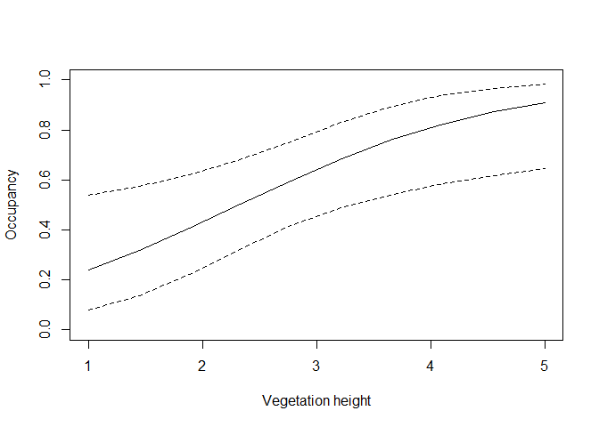

Occupancy-lab
================
Nick Gulotta
10/27/2021

## **Ex 1.Null Model-single season**

#### **Ex.1-Null model output**

``` r
#null model
nullModel <- occu(~1 ~1, umf)
summary(nullModel)
```

    ## 
    ## Call:
    ## occu(formula = ~1 ~ 1, data = umf)
    ## 
    ## Occupancy (logit-scale):
    ##  Estimate    SE    z P(>|z|)
    ##     0.498 0.328 1.52   0.129
    ## 
    ## Detection (logit-scale):
    ##  Estimate    SE      z P(>|z|)
    ##   -0.0384 0.211 -0.182   0.856
    ## 
    ## AIC: 229.0629 
    ## Number of sites: 50
    ## optim convergence code: 0
    ## optim iterations: 13 
    ## Bootstrap iterations: 0

``` r
## Occupancy estimate - Pr(site is occupied)
backTransform(nullModel, type="state")
```

    ## Backtransformed linear combination(s) of Occupancy estimate(s)
    ## 
    ##  Estimate     SE LinComb (Intercept)
    ##     0.622 0.0771   0.498           1
    ## 
    ## Transformation: logistic

``` r
## Detection estimate - Pr(detection | site is occupied)
backTransform(nullModel, type="det")
```

    ## Backtransformed linear combination(s) of Detection estimate(s)
    ## 
    ##  Estimate     SE LinComb (Intercept)
    ##      0.49 0.0528 -0.0384           1
    ## 
    ## Transformation: logistic

#### **Ex.1-Question A**

-   The probability that a site is occupied is Ψ = 0.62 (SE= 0.07), and
    the probability of detection on a single visit if the site is
    occupied is p = 0.48 (SE=0.05).

-   There is a 0.62 probability that a site will be occupied by a quail,
    and if you visit that site at least once you have a 0.48 probability
    of detecting a quail.

### **Ex.1-Single season vegetation added as covariate**

``` r
#model 2 habitat index
detNullOccHab <- occu(~1 ~veght, umf)
summary(detNullOccHab)
```

    ## 
    ## Call:
    ## occu(formula = ~1 ~ veght, data = umf)
    ## 
    ## Occupancy (logit-scale):
    ##             Estimate    SE     z P(>|z|)
    ## (Intercept)   -2.012 0.963 -2.09  0.0367
    ## veght          0.865 0.337  2.57  0.0102
    ## 
    ## Detection (logit-scale):
    ##  Estimate    SE      z P(>|z|)
    ##   -0.0319 0.209 -0.153   0.879
    ## 
    ## AIC: 222.5917 
    ## Number of sites: 50
    ## optim convergence code: 0
    ## optim iterations: 16 
    ## Bootstrap iterations: 0

``` r
#visualize
predData <- data.frame(veght=seq(from=1, to=5, length.out=10))

predOcc <- predict(detNullOccHab, newdata=predData,
                   type="state", append=TRUE)
```

#### **Ex.1- Question c **

-   The second model that contains the covariate of vegetation height
    had a lower AIC value (AIC = 222.59) compared to the null-model (AIC
    = 229.06). This indicates model containing the covariate explains
    more of the variation with the least amount of parameters, and is
    essentially a better model than the null-model.

#### **EX.1-Plot**

``` r
#plot
plot(Predicted ~ veght, data=predOcc, type="l", ylim=c(0,1),
     xlab="Vegetation height", ylab="Occupancy")
lines(lower ~ veght, data=predOcc, lty=2)
lines(upper ~ veght, data=predOcc, lty=2)
```

<!-- -->

#### **Ex.1-Question E**

-   The occurrence probability increases with increasing vegetation
    height. The higher the vegetation the higher probability of quail
    occupying a site.

### **Ex.2-null model multi -season **

``` r
#null model
nullModelMS <- colext(~1, ~1, ~1, ~1, umfMS)
summary(nullModelMS)
```

    ## 
    ## Call:
    ## colext(psiformula = ~1, gammaformula = ~1, epsilonformula = ~1, 
    ##     pformula = ~1, data = umfMS)
    ## 
    ## Initial (logit-scale):
    ##  Estimate   SE     z P(>|z|)
    ##      3.88 8.25 0.471   0.638
    ## 
    ## Colonization (logit-scale):
    ##  Estimate   SE     z P(>|z|)
    ##      4.57 26.8 0.171   0.865
    ## 
    ## Extinction (logit-scale):
    ##  Estimate   SE      z P(>|z|)
    ##     -8.88 36.7 -0.242   0.809
    ## 
    ## Detection (logit-scale):
    ##  Estimate  SE     z  P(>|z|)
    ##    -0.877 0.2 -4.39 1.16e-05
    ## 
    ## AIC: 173.4767 
    ## Number of sites: 15
    ## optim convergence code: 0
    ## optim iterations: 44 
    ## Bootstrap iterations: 0

``` r
#backtransform
backTransform(nullModelMS, type="psi")
```

    ## Backtransformed linear combination(s) of Initial estimate(s)
    ## 
    ##  Estimate    SE LinComb (Intercept)
    ##      0.98 0.164    3.88           1
    ## 
    ## Transformation: logistic

``` r
backTransform(nullModelMS, type="col")
```

    ## Backtransformed linear combination(s) of Colonization estimate(s)
    ## 
    ##  Estimate    SE LinComb (Intercept)
    ##      0.99 0.272    4.57           1
    ## 
    ## Transformation: logistic

``` r
backTransform(nullModelMS, type="ext")
```

    ## Backtransformed linear combination(s) of Extinction estimate(s)
    ## 
    ##  Estimate      SE LinComb (Intercept)
    ##  0.000139 0.00508   -8.88           1
    ## 
    ## Transformation: logistic

``` r
backTransform(nullModelMS, type="det")
```

    ## Backtransformed linear combination(s) of Detection estimate(s)
    ## 
    ##  Estimate     SE LinComb (Intercept)
    ##     0.294 0.0415  -0.877           1
    ## 
    ## Transformation: logistic

``` r
# create HTML table using kableExtra
library(kableExtra)
# create HTML table using kableExtra
library(kableExtra)
require(knitr)

Estimate<-(c(0.98, 0.99,0.000139, 0.294))
SE<-(c(0.164,0.27, 0.00508, 0.041))
Term<-(c("psi", "gamma", "epsilon", "p"))
tab<-data.frame(Term,Estimate,SE)


#table 
options(knitr.kable.NA = "") # leave NA cells empty
knitr::kable(tab, digits = 3,booktabs=T, align="c",
       caption = "<center><strong>Table 1. Multi-season occupancy of two-lined salamanders.</strong></center>")%>%
  kable_styling(bootstrap_options = c("striped", "hover", "condensed", "bordered"))
```

<table class="table table-striped table-hover table-condensed table-bordered" style="margin-left: auto; margin-right: auto;">
<caption>
<center>
<strong>Table 1. Multi-season occupancy of two-lined
salamanders.</strong>
</center>
</caption>
<thead>
<tr>
<th style="text-align:center;">
Term
</th>
<th style="text-align:center;">
Estimate
</th>
<th style="text-align:center;">
SE
</th>
</tr>
</thead>
<tbody>
<tr>
<td style="text-align:center;">
psi
</td>
<td style="text-align:center;">
0.980
</td>
<td style="text-align:center;">
0.164
</td>
</tr>
<tr>
<td style="text-align:center;">
gamma
</td>
<td style="text-align:center;">
0.990
</td>
<td style="text-align:center;">
0.270
</td>
</tr>
<tr>
<td style="text-align:center;">
epsilon
</td>
<td style="text-align:center;">
0.000
</td>
<td style="text-align:center;">
0.005
</td>
</tr>
<tr>
<td style="text-align:center;">
p
</td>
<td style="text-align:center;">
0.294
</td>
<td style="text-align:center;">
0.041
</td>
</tr>
</tbody>
</table>

#### **Ex.2- Questions c-e**

3.  There is a high probability of occupancy (ψ=0.98), high probability
    of colonization(γ=0.99), and a low probability of extinction
    (*ϵ*=0.00013). If you visit a site at least once the probability of
    detecting a salamander is (p=0.29).

4.  Since colonization is extremely high and extinction is very low this
    would mean salamanders are occupying sites consistently from
    year-year.

5.  I would be a bit skeptical with the results just from a sampling
    perspective. I think we might have violated the assumption of
    independence by selecting sites that were easy to access via roads
    and distance between ponds. To improve this going forward, we should
    use a stratified random sampling scheme. This would reduce the
    amount of bias and improve the overall confidence in the estimate.
    Additionally, the assumption of population closure was potentially
    violated. This would increase the bias in the estimate which would
    partially explain the high colonization and occupancy, and low
    colonization.
